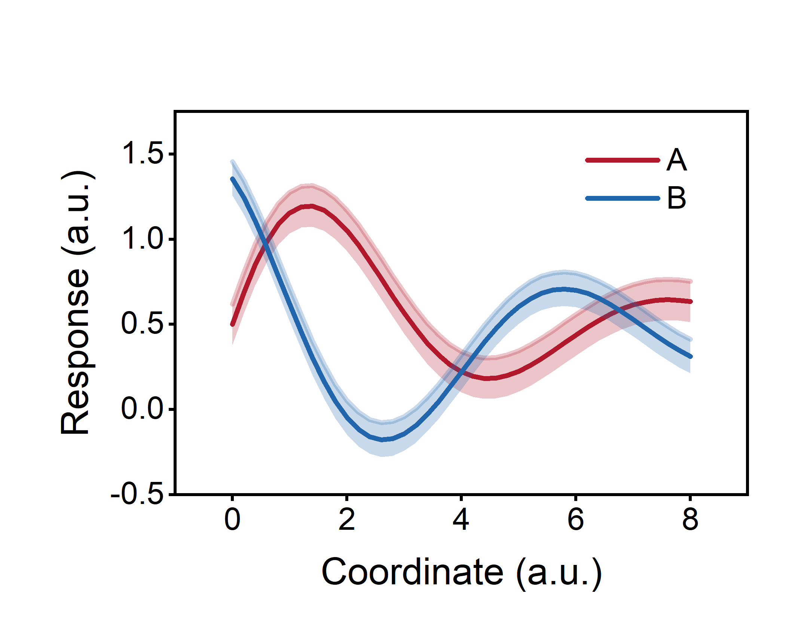
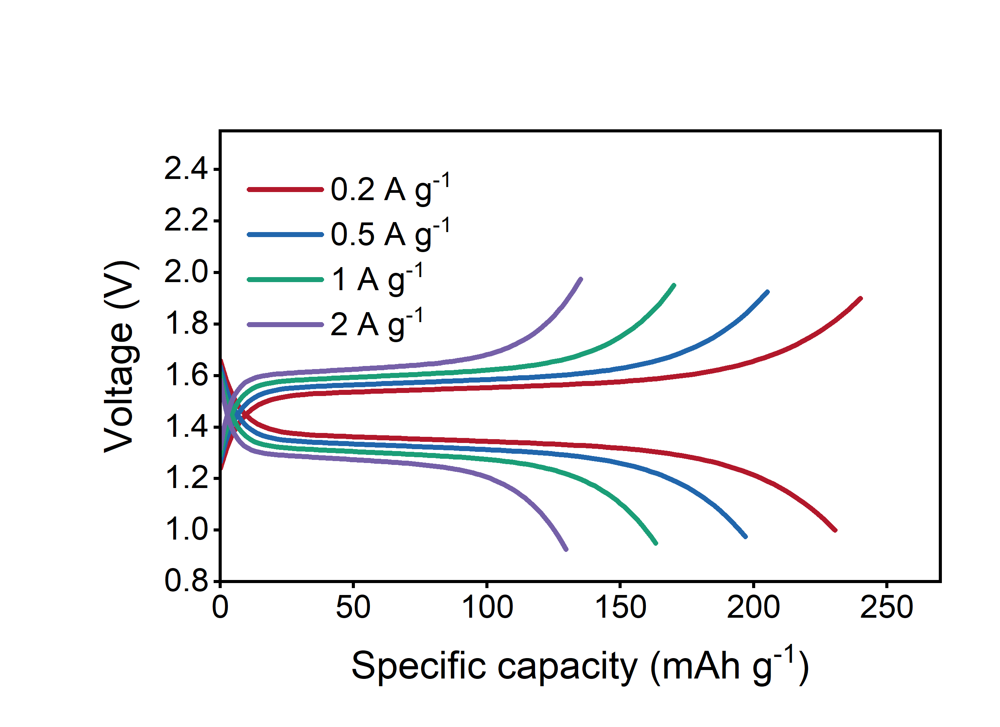
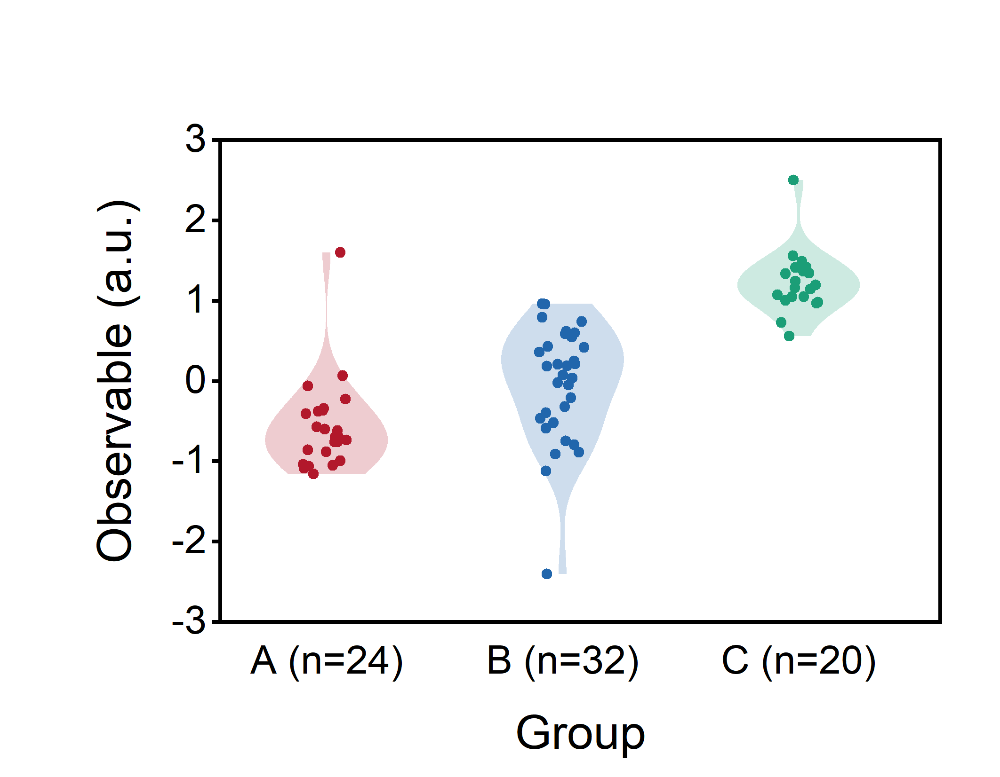
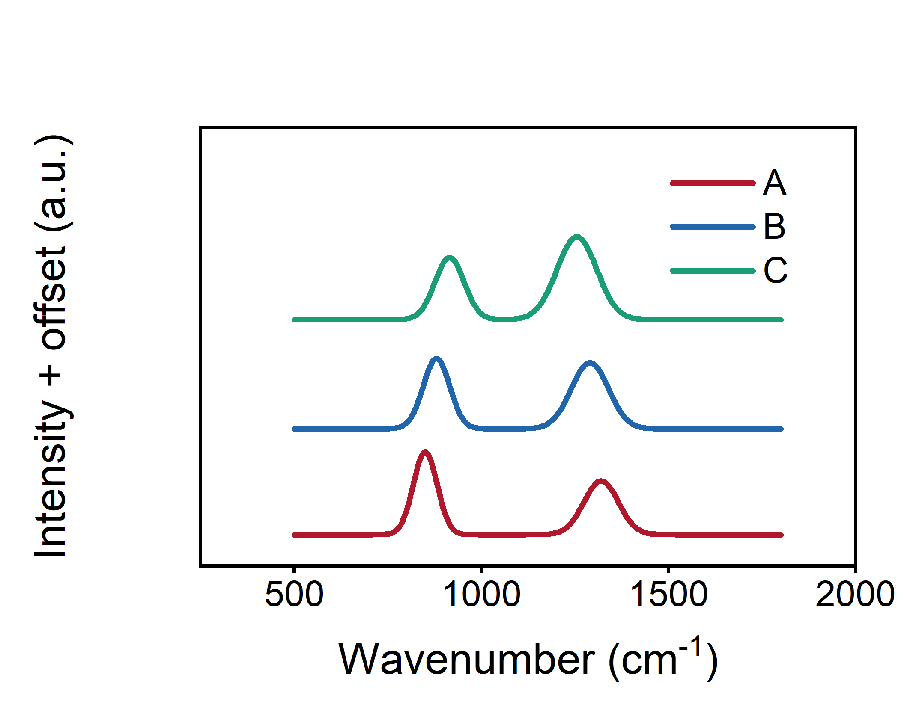
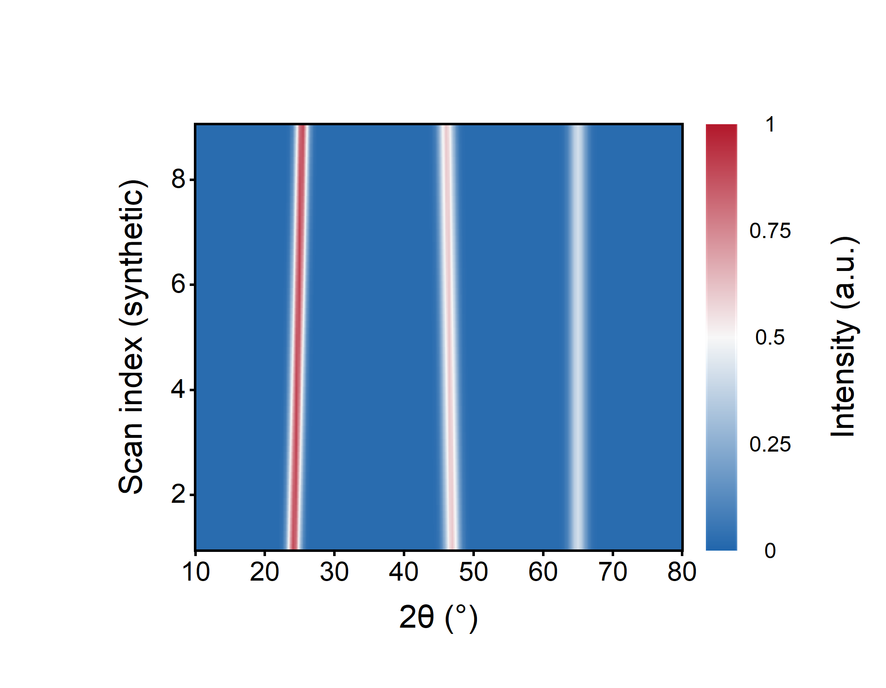

# Ai2origin

Give your agent scientific data and a plotting goal. Ai2origin helps it inspect
the files, choose a suitable plot and keep the result reproducible.

**Origin 2021:** PNG and editable OPJU. **Python:** PNG, with optional SVG.
Version **0.3.7**. All examples are synthetic.

Created by [yunyun](https://github.com/yunyunFlow).

## Try it

Python 3.10+; install the dependencies, then run an example:

~~~sh
python -m pip install -r requirements.txt
python scripts/ai2origin.py samples/demo.json --out ../ai2origin-work/demo --backend python
~~~

Run commands from the repository folder; outputs go to a new folder beside it.
Add --svg for an editable vector copy.
Arial must be installed on your system. If missing, run
`python scripts/ai2origin.py --list-fonts` and choose
--font "Installed name". No fonts are bundled, copied or downloaded;
the receipt records the actual font. [Font policy](references/style.md).

For Codex, put this repository's contents in a skill folder named ai2origin
and invoke $ai2origin. You can also ask your agent to read [SKILL.md](SKILL.md).
Copy the [starter prompt](START.md) to start or continue a task.

> Plot these battery tables as voltage–specific-capacity curves, compare the
> selected cycles, and keep all measured points.

The agent handles routine configuration. Templates are starting points; your AI
can adapt the plot to other data and check your local tools and output.
The [table adapter](references/tables.md)
supports explicit flat CSV/TSV/TXT/XLSX mappings; instrument binaries and arbitrary
existing Origin projects need a separate adapter.

## Origin output

Use an installed, working Origin 2021 on Windows. For other versions, let your
AI adapt the workflow and check the result.

~~~sh
python scripts/ai2origin.py samples/demo.json --out ../ai2origin-work/prepared --backend prepare
~~~

~~~powershell
powershell -NoProfile -ExecutionPolicy Bypass -File .\scripts\origin.ps1 -Plan ..\ai2origin-work\prepared\origin-plan.json -OutDir ..\ai2origin-work\native -Run
~~~

Save and close any open Origin session first. The runner checks values,
saves/reopens the project and exports its graphs. [Native details](references/origin2021.md).

## Examples and checks

### Gallery

All values are invented. These six figures are Origin exports.

| XY bands | Battery curves | Raincloud |
| --- | --- | --- |
|  |  |  |

| Spectral stack | XRD heatmap | Field heatmap |
| --- | --- | --- |
|  |  |  |

Browse [samples](samples/README.md) and [templates](templates/README.md).
The [Field heatmap config](samples/heatmap-purplegreen.json) is ready to reuse.
Sparse line-symbol curves can use 5–6 pt markers through a
[style override](references/style.md); keep dense data readable.

Try a family with Python:

~~~sh
python scripts/ai2origin.py templates/battery.json --out ../ai2origin-work/battery --backend python
python scripts/ai2origin.py templates/paper.json --select cv nyquist --out ../ai2origin-work/echem --backend python
python scripts/ai2origin.py templates/paper.json --select drt drt-map --out ../ai2origin-work/drt --backend python
python scripts/ai2origin.py templates/paper.json --select migration dos rdf msd --out ../ai2origin-work/atomistic --backend python
~~~

### From a table to a figure

The included 11-point synthetic CV example exercises column mapping and plotting:

~~~sh
python scripts/intake.py samples/intake.csv --map samples/intake.json --out ../ai2origin-work/table
python scripts/intake.py --check ../ai2origin-work/table
python scripts/ai2origin.py ../ai2origin-work/table/plot.json --out ../ai2origin-work/table-figure --backend python
~~~

The mapping declares columns and units; [table details](references/tables.md)
explain the optional summary. Use your own verified mapping for real data.

### Before sharing a figure

- Open the actual export: readable labels, correct units, clean legends and no clipping.
- Check every assigned point, branch and group against its source.
- Keep the config and receipt with the figure; state requested processing.
- For Origin delivery, check the saved project's read-back and reopen results.

Python accepts literal percentage labels such as `Capacity retention (%)`.
It also reports possible legend intersections and text outside the canvas.
Adjust the task's axis ranges or canvas size and inspect the export again.

See [tested scope and remaining limits](VALIDATION.md): the local run used Python 3.11
and Origin 2021. Your AI can adapt the workflow to another setup and verify
the actual results.
Development tests and optional repeat checks are in [Contributing](CONTRIBUTING.md).

[MIT license](LICENSE) · [Dependencies and sources](THIRD_PARTY_NOTICES.md) ·
[Use notice](DISCLAIMER.md). Fonts, commercial software and real research data
are not distributed.
