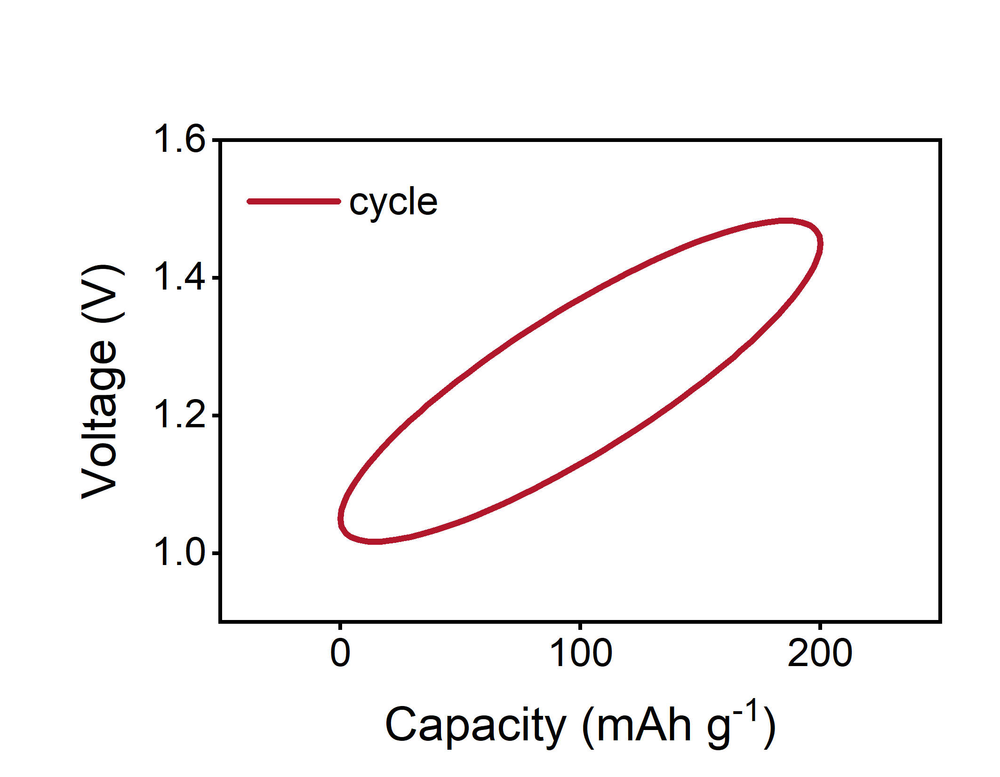
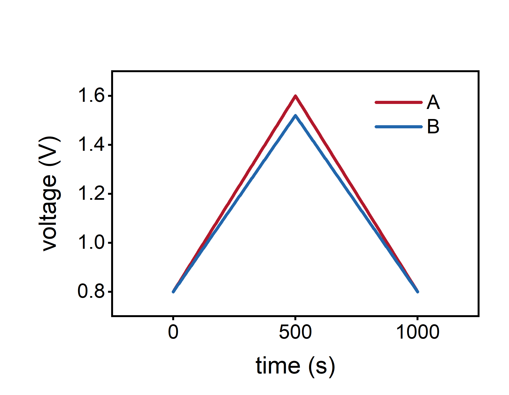
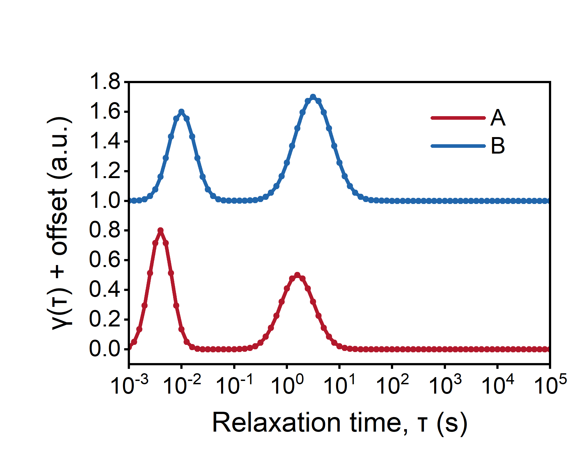
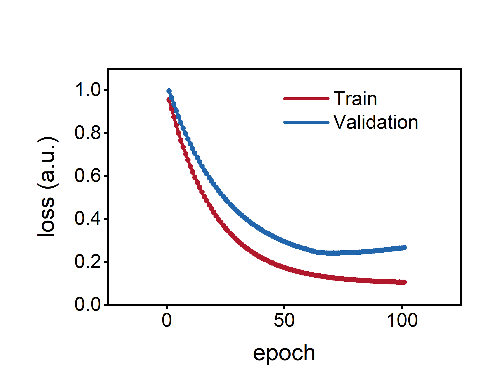

# Article-oriented synthetic templates

The established inputs are invented by scripts/make_templates.py. These are plot recipes,
not measured electrochemistry, computed electronic structure or fitted evidence.
The full template set is paper.json; seven smaller configs select a family.

The additional battery.json has pure-line voltage–specific-capacity overlays
for three cycles (six branches) and four current densities (eight branches),
plus an optional voltage-time example, generated by make_battery.py.
Their PNG/explicit SVG and prepared geometry pass Python QA; new native
acceptance is HOLD. They are separate from the 36 accepted native article
recipes and do not replace their evidence.

| Cycle overlay (Python) | Rate overlay (Python) |
| --- | --- |
|  |  |

Specific capacity is assigned in mAh g^-1; voltage is in V. Charge and
discharge are both solid lines, sharing one group color and one legend key. Both branches start
at zero assigned capacity and retain their own X column; 101 nodes per branch,
straight links and no markers. Formulas, capacity endpoints and the toy mass
basis are disclosed in the config caption. These are generic invented shapes,
not digitized literature measurements, measured polarization or CE evidence.
Recorded real discharge coordinates may follow another convention; preserve
that convention rather than reversing or translating a branch for appearance.
No real active mass is inferred from the optional absolute-capacity time trace.

~~~sh
python scripts/ai2origin.py templates/battery.json --out work/battery --backend python
~~~

Keep channel/cycle/step/current sign/branch and capacity basis when mapping
real battery records. See [table intake](../references/tables.md); never
resample unequal branch grids merely to fill this example's wide table.

| Config | Implemented recipes |
| --- | --- |
| electrochem.json | CV, capacity/time GCD, retention/capacity/CE cycling, rate, GITT-shaped pulses, Nyquist, Bode magnitude/phase |
| characterization.json | Spectral overlay, three-trace stack, diffraction profile |
| dft-md.json | Seven-point migration profile, DOS, RDF, MSD |
| analysis.json | Descriptor/response scatter, OLS residual scatter |
| drt.json | Assigned DRT curves, DRT stack and condition-resolved map |
| other.json | Stress-strain, TGA, DSC, conversion kinetics, train/validation loss |
| domains.json | Magnetic hysteresis/susceptibility; UV–vis/PL/fluorescence decay; dose response/growth/enzyme kinetics |

~~~sh
python scripts/ai2origin.py templates/electrochem.json --out work/echem --backend python
python scripts/ai2origin.py templates/paper.json --out work/article --backend prepare
~~~

CV/GCD/Nyquist declare connect_order=acquisition. Do not sort a cycling branch
by voltage or deduplicate its turning points. Stack offsets are declared per
series; the native prepared workbook retains raw and shifted values separately.
The generator also stores the exact toy OLS fit and residual columns.

All 36 templates have individual Origin 2021 native export,
saved-project numerical read-back/reopen, reopened export and visual acceptance.
Every original/reopened pair has identical pixels. The final native images are
origin-*.png; Python PNG/SVG are separate Arial previews, separately reviewed.
Per-image source/caption/config/output hashes are in validation.json.
The compact distribution keeps native PNGs and the three battery PNGs;
duplicate Python PNG/SVG galleries remain local. Original validation records
retain their hashes. Regenerate optional previews from the included configs.
Physical request: 90×70 mm, 600 DPI, actual native PNG 2125×1653 pixels;
Arial ticks/legend 10 pt, axis titles 12 pt, auxiliary text 8 pt; black four-sided 1 pt frame, ticks only bottom/left. No default top title. Native x/y title-to-number gaps are aligned from actual exported pixels.

| Electrochemistry | Native examples |
| --- | --- |
| CV / GCD |   |
| Cycling / Nyquist |   |
| Time GCD / GITT-shaped pulses |   |
| Capacity / CE |   |
| Rate / Bode magnitude |   |
| Bode phase / DRT |   |
| DRT stack / map |   |

| Spectra and characterization | Native examples |
| --- | --- |
| Overlay / explicit offsets |   |
| Diffraction |  |

| DFT/MD display recipes | Native examples |
| --- | --- |
| Energy path / DOS |   |
| RDF / MSD |   |

| Stored toy OLS | Native examples |
| --- | --- |
| Observations + fit / residuals + zero |   |

| Other fields | Native examples |
| --- | --- |
| Mechanics / thermal mass |   |
| Thermal flow / conversion |   |
| Learning curve |  |

| Magnetic, optical and biological displays | Native examples |
| --- | --- |
| Hysteresis / susceptibility |   |
| UV–vis / PL |   |
| Fluorescence decay / dose response |   |
| Growth / enzyme kinetics |   |

These eight recipes are independently assigned analytic demonstration
functions, not digitized measurements. Hysteresis retains increasing and
decreasing field branches in acquisition order. Dose-response coordinates are
actual positive concentrations on a native log axis. No coercivity/lifetime/
IC50/Km fit or physical/biological interpretation is performed.

Each recipe carries a synthetic caption in JSON, retained in the prepared
plan with the source SHA256. CV/GCD captions require an arbitrary toy voltage
reference; real work must declare reference electrode and capacity basis.
Nyquist declares equal_xy=true, explicit ranges and 5-ohm tick steps; one ohm
has the same physical size on both axes. Both ranges are [0,30] Ω; the frame is square. This is an invented arc, not a fit.
Spectra use explicit 500-inverse-cm ticks; stack offsets are 0/1.3/2.6.
Migration retains seven images and endpoint tilt; DOS/RDF/MSD-shaped curves
come from analytic formulas, with no engine or trajectory interpretation.
The 36 OLS observations use seed 1729, an unweighted line with intercept,
stored fitted values and residual=observed-fitted. BLAS/LAPACK may differ at
the last floating-point digits; regeneration is compared with roundoff tolerance.

Optional per-series kind selects line/scatter/line_symbol inside an XY recipe.
Caption is receipt metadata, not text drawn over the data. x_tick_step and
y_tick_step are positive axis-unit intervals. equal_xy currently requires
explicit increasing XY ranges and geometry fitting the native page; other
geometries fail explicitly. These settings preserve every numerical value.

Use ../references/paper.md to adapt a recipe to an actual article. Template
selection does not validate a method, fit, mechanism or physical model.

All map coordinates are invented; DRT and XRD intensity maps use the same
blue-white-red palette, [0,1] range and white=0.5. DRT binds positive tau (s)
to a native log10 axis over 10^-3–10^5. Factor-8 bilinear display interpolation
in log10(tau),y retains all raw nodes. NEB uses a disclosed PCHIP display guide
and original markers, with node-based barriers. GITT stores toy pulse current
but does not extract diffusion; DRT does not invert EIS.
